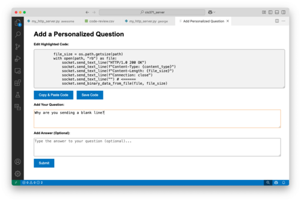

# gvQLC

The `gvQLC` extension allows instructors to prepare custom quiz questions for each student based specifically on code he or she submits. 

In particular, this extension allows instructors to 
   1. highlight a segment of submitted code, 
   2. select the `gvQLC: New Quiz Question` command, then 
   3. enter a question about the selected code in Markdown format. 

After preparing one or more questions for each student, `gvQLC` can then prepare a quiz customized for each student, either in PrairieLearn format, or as a set of `.pdf` files that can be printed and distributed.

## Motivation 

This extension is motivated by [Teemu Lehtinen's Ph.D. dissertation](https://aaltodoc.aalto.fi/items/f3d7183b-fd7f-4ff7-b624-89af3c5aa118). His work uses the phrase <em>Q</em>uestions over <em>L</em>earner's <em>Code</em>, which is the the `QLC` in `gvQLC`.

It is possible for students to submit code that is functionally correct, even though the students has not met assignment's learning goals. This can happen for several reasons: Sometimes tutors give too much (or the wrong type) of help. Sometimes, student make seemingly random changes to the code until it works. Sometimes students cheat.

The "gold standard" for addressing this issue is to give students a customized, oral exam over the code. Unfortunately, this process does not scale well: It is not practical to administer such an exam to each student in a large course. 

For small- and medium-sized courses, many instructors take the time to read through and comment on submitted code. We believe that, with the right tools (e.g., `gvQLC`), instructors can efficiently write custom questions while they are reading the code and preparing feedback.

To be clear: We believe that the process of creating custom quiz questions for students can be reasonably efficient
   * for courses/sections of up to about 40 students
   * _if_ the instructor has already allocated time to review and comment on all student submissions.
The approach proposed here will be significantly larger time burden in very large courses, or for courses where the instructor has not already allocated time for reviewing code (as opposed to allowing code to be completely auto-graded).

# Workflow / Basic Usage

**Collect Submissions:** Begin by collecting all submissions into a single VS Code project. Each student's code should be in a subdirectory at the root of the project.  For example:

<pre>
* Project1
  * smithj
    * Character.java
    * Game.java
  * jonesb
    * Character.java
    * Game.java
  * patilr
    * Character.java
    * Game.java
</pre>

We have two primary methods of collecting student submissions:
   1. For PrairieLearn assignments, we simply go to the `Downloads` tab for the assignment, then choose the `*_final_files.zip` option. Uncompressing this zip file produces a directory with the desired organization.
   2. For assignments managed using GitHub Classroom, we have a script that will clone each repository into the project directory. Each repository then becomes a subdirectory at the root level of the project. 

**Review Submissions:** Once the code is collected, you can browse the files and leave feedback for the students. Our preferred method is to simply add comments with an easily searchable prefix (e.g., `# zk I like your approach here`)

**Prepare Quiz Questions:** While reviewing the code, instructors can write a quiz question that specifically references a segment of code. To do this
  1. Highlight that segment of code in the editor.
  2. Open the Command Palette (Ctrl+Shift+P or Cmd+Shift+P) and select `gvQLC: New Quiz Question". (Or use the short-cut: Cmd+Shift+.)
  3. Add your question text in Markdown format
     * You can modify the selected code (e.g., if you want to draw attention to a specific line), or
     * You can select, copy and paste part of the selected code into the question text.
  4. Press `Submit`



**Prepare a Quiz**: To prepare a quiz:
  1. From the Command Palette, select `gvQLC: View Quiz Questions`
     * From here you can edit and/or exclude questions.
     * The colors in the leftmost column indicate the number of questions for that student. Use this if you want to be sure each quiz has the same number of questions.
  2. Prepare a quiz configuration file.  (See details below.)
  3. From the command Pallette, select `gvQLC: Generate PrairieLearn Quiz`, then select the config file. The command will place the questions and assessments into the chosen PrairieLearn repository.   

# Feature Details
  1. Add Quiz Question
  2. View Quiz Questions

  2. Ask Practice Question
  3. Answer Practice Question
  4. View Practice Questions and Answers
 

  7. Generate Quiz Questions

## 1. Add Quiz Question
 1. Highlight the relevant code snippet in your editor (must be non-empty).
 2. Open the Command Palette (Ctrl+Shift+P/Cmd+Shift+P) and select "New Quiz Question". (Also available through Cmd+Shift+.)
 3. An interactive panel opens where you can:
    - Edit the selected code. (For example, you may want to add a comment to highlight a particular aspect of the code.)
    - Write a question in Markdown format.
    - Write an answer. (This is optional. It is mainly useful if the question is computational in nature, or a different person is grading the quiz.) 
    - Copy and Paste code into the question text. Sometimes, is is helpful to place a copy of the selected code into the question. Rather than having to select, copy, and paste in three separate steps, you can simply select the desired snipped and press the "Copy & Paste Code" button. The selected snippet will then be inserted into the question and marked up as code.

### 2. View Quiz Questions

Open the Command Palette (Ctrl+Shift+P/Cmd+Shift+P) and select "View Quiz Questions". (Also available through Cmd+Shift+V.) A panel opens showing all saved quiz questions in a table format. Each row contains:
  - A question number.  
     * The question number is of the format "1a". The number refers to the student (i.e., the questions for a given student all have the same number). The letter refers distinguishes between the questions for a given student (i.e., Student 3 will have questions 3a, 3b, 3c, etc.)  
     * The color of this cell shows how many questions the student has compared to other students.

      - The source file location (shortened path)
      - The actual code snippet referenced
      - The full question text
      - An "Exclude from Quiz" checkbox
    - Interactive controls to:
      - Edit question text or code snippet
      - Delete unwanted questions
      - Toggle exclusion from future quizzes
  4. Key Notes:
    - Changes save automatically when you close the panel
    - Excluded questions remain stored but won't appear in generated quizzes
    - Plain text display without extra formatting or metadata


### 2. Ask Practice Question
- **How to Use**:
  1. Open the Command Palette (Ctrl+Shift+P or Cmd+Shift+P) and select "Ask Practice Question".
  2. Select a code snippet in the active editor (must be a valid, non-empty selection).
  3. A panel will open where you can:
     - View the selected code (editable before submission).
     - Type your question about the code.
     - Submit the question, which will be saved in questionsData.json.
  4. The question will be stored with metadata including:
     - The file path where the question was asked.
     - The exact code range (line numbers and characters).
     - The highlighted code snippet.
     - The question text.

  - **Note**
    - Questions can later be answered via the "Answer Question" command.
    - All questions are visible in the "View Questions and Answers" panel.
    - Works per-student if used in a structured workspace (e.g., CIS500/student_name/).
  

### 3. Answer Practice Question
- **How to Use**:
  1. Open the Command Palette (Ctrl+Shift+P or Cmd+Shift+P) and select "Answer Practice Question".
  2. A list of all unanswered questions will appear in a Quick Pick menu.
  3. Select a question to answer.
  4. A panel will open showing:
   - The original question.
   - The highlighted code snippet.
   - A text area to type your answer.
   - A copy and paste feature that can copy the entire highlighted code snippet and paste it in the text box
  5. Submit your answer to save it.
  - **What Happens:**
    - The answer is stored with the question in questionsData.json.
    - The question is marked as answered and can be viewed later.
    - If the workspace has student-specific folders (e.g., CIS500/student_name/), the answer is saved in both:
    - The global questionsData.json (for instructor reference).
    - The student's questionsData.json (for personalized tracking).
  - **Notes:**
    - Answers can be viewed or exported via "View Questions and Answers".
    - Supports rich text formatting in answers.
    - Questions can be filtered by student or file in structured workspaces.

### 4. View Practice Questions and Answers
- **How to Use**:
  1. Open the Command Palette (Ctrl+Shift+P or Cmd+Shift+P) and select "View Questions and Answers".
  2. A webview panel will open displaying:
    - A sortable table of all questions and answers.
    - Columns showing:
      - Question number
      - Source file path (shortened for readability)
      - Highlighted code snippet
      - Full question text
      - Given answer (if available)
  3. Key Features:
    - Export Capability: Click the "Export to CSV" button to save all Q&A data for record-keeping.
    - Smart Filtering:
      - Questions are automatically grouped by student in structured workspaces
      - Unanswered questions appear highlighted
    - Code Display:
      - Syntax-highlighted code snippets
      - Full code visibility with horizontal scrolling
    - Data Management:
      - Pulls from both:
        - Central questionsData.json (all questions)
        - Student-specific files (in individual folders)
      - Maintains original formatting of questions and answers


### 7. Generate Quiz Questions
- **How to Use**:
  1. Open the Command Palette (Ctrl+Shift+P/Cmd+Shift+P) and select "Generate Personalized Quiz".
  2. Select a config file (cqlc.config.json) when prompted. Below is a sample of the config file
  3. The system automatically:
    - Collects all non-excluded questions from personalizedQuestions.json
    - Groups them by student based on file paths
    - Generates individual quiz folders for each student
  4. What Gets Created:
    - For each student:
      - A question bank folder with:
        - question.html files (containing question text + code snippets)
        - info.json files (with unique IDs and basic metadata)
      - An assessment folder with:
        - infoAssessment.json (quiz settings like time limits and access dates)
  5. Configuration File Sample
      - Below is an example configuration file used in the extension:

      ```json
      {
          "title": "Dass",
          "topic": "dayyy",
          "folder": "osei",
          "pl_root": "/Users/benedictoseisefa/Desktop/pl-gvsu-cis500dev-master",
          "pl_question_root": "PersonalQuiz",
          "pl_assessment_root": "courseInstances/TemplateCourseInstance/assessments",
          "set": "Custom Quiz",
          "number": "2",
          "points_per_question": 10,
          "startDate": "2025-03-22T10:30:00",
          "endDate": "2025-03-22T16:30:40",
          "timeLimitMin": 30,
          "daysForGrading": 7,
          "reviewEndDate": "2025-04-21T23:59:59",
          "password": "letMeIn",
          "language": "python"
      }

    - Configuration Fields Explained

      | Field                | Description                                           | Example Value |
      |----------------------|-------------------------------------------------------|--------------|
      | `title`             | The title of the quiz or assessment.                  | "Dass"       |
      | `topic`             | The topic associated with the quiz.                    | "dayyy"      |
      | `folder`            | The folder where the quiz is stored.                   | "osei"       |
      | `pl_root`           | Root directory for quiz configurations.                | "/Users/.../pl-gvsu-cis500dev-master" |
      | `pl_question_root`  | Directory for personal quiz questions.                 | "PersonalQuiz" |
      | `pl_assessment_root`| Path to assessment storage within a course.            | "courseInstances/TemplateCourseInstance/assessments" |
      | `set`               | Type of quiz set.                                      | "Custom Quiz" |
      | `number`            | Number of questions in the quiz.                       | 2            |
      | `points_per_question` | Points assigned to each question.                   | 10           |
      | `startDate`         | Start date and time for the quiz.                      | "2025-03-22T10:30:00" |
      | `endDate`           | End date and time for the quiz.                        | "2025-03-22T16:30:40" |
      | `timeLimitMin`      | Time limit for completing the quiz in minutes.         | 30           |
      | `daysForGrading`    | Number of days allowed for grading.                    | 7            |
      | `reviewEndDate`     | Deadline for reviewing the quiz results.               | "2025-04-21T23:59:59" |
      | `password`          | Password required to access the quiz.                  | "letMeIn"    |
      | `language`          | Programming language used for quiz questions.          | "python"     |


  6. Output Location:
    - Creates structured folders under:
      - prairielearn/questions/ (for question content)
      - prairielearn/assessments/ (for quiz settings)
    - Important Notes:
      - Only includes questions NOT marked "exclude from quiz"
      - Preserves original code formatting from student submissions


---

## **Installation**

1. Open Visual Studio Code.
2. Go to the Extensions Marketplace (`Ctrl+Shift+X` or `Cmd+Shift+X` on Mac).
3. Search for **Prairielearn Code Review Extension**.
4. Click **Install**.


## **Commands and Shortcuts**
| Command                                | Shortcut            | Context Menu Option              |
|----------------------------------------|---------------------|----------------------------------|
| Ask Practice Question                  | `Ctrl+Shift+P`      | Yes                              |
| Answer Practice Question               | `Ctrl+Shift+P`      | Yes                              |
| View Practice Questions and Answers    | `Ctrl+Shift+P`      | No                               |
| Add Quiz Question                      | `Ctrl+Shift+P`      | No                               |
| View Quiz Questions                    | `Ctrl+Shift+P`      | No                               |
| Generate Quiz Questions                | `Ctrl+Shift+P`      | Non                              |

---


## **Contributing**

If you find a bug or have an idea for an improvement, feel free to contribute!

1. Fork this repository.
2. Create a new branch (`git checkout -b feature/my-feature`).
3. Commit your changes (`git commit -am 'Add some feature'`).
4. Push to the branch (`git push origin feature/my-feature`).
5. Open a pull request.

---

## **License**

This extension is licensed under the [MIT License](https://opensource.org/licenses/MIT).

